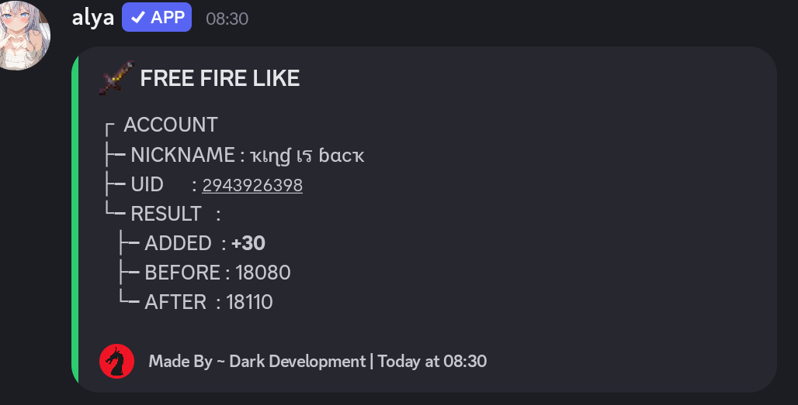
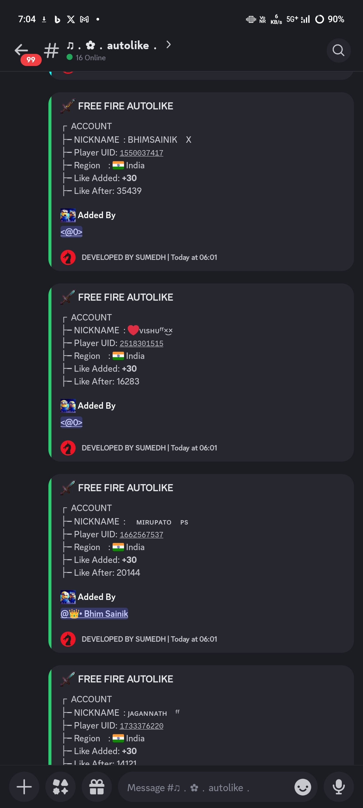
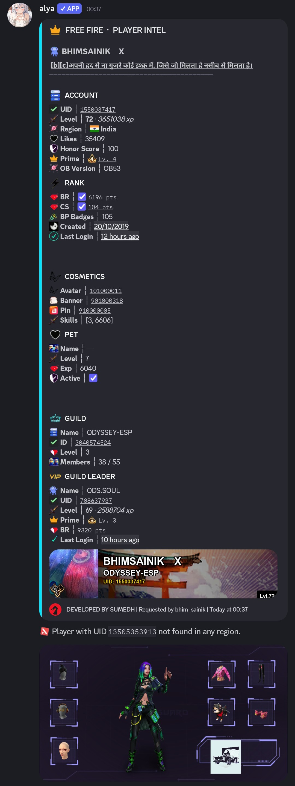
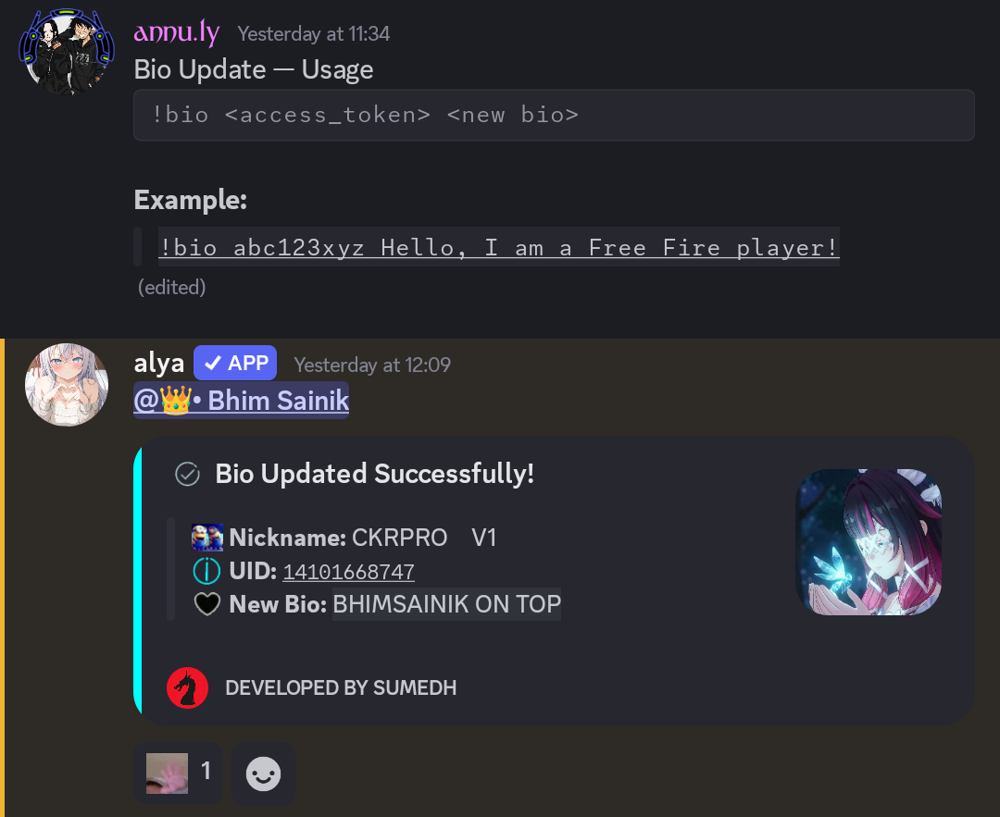

# 🔥 Free Fire Discord Bot

> **DEVELOPED BY SUMEDH**  
> A powerful Free Fire Discord bot with likes, autolike scheduler, player info, token management and more.
### join my discord for bot [discord server](https://bhimsainik.qzz.io)
---

## 📸 Preview

### ⚔️ /like Command


### 🎁 AutoLike Log


### 👑 /info Command


### 🧬 /bio Command



---

## ✨ Features

- **`/like`** — Send likes to any Free Fire player (IND / BR / BD zones)
- **`/info`** — Full player profile with profile card image, guild, pet, rank info
- **`/addautolike`** — Schedule daily automatic likes for a UID
- **`/startautolike`** — Manually trigger autolike for all active UIDs
- **Token Manager** — Auto-refresh GitHub-stored tokens every 6 hours
- **Multi-zone support** — BR, IND, BD
- **`/bio`** — Set a custom Free Fire profile bio for your account
- **`/tr`** — Translate text to any language

---

## 🛠️ Commands

### 🎮 Player Commands
| Command | Description |
|---------|-------------|
| `/like <server> <uid>` | Send likes to a player |
| `/info <uid>` | Full player profile + card |
| `/likestats` | Your like statistics |
| `/likestats @user` | Any user's stats |

### 🎁 AutoLike Commands
| Command | Description |
|---------|-------------|
| `/addautolike <server> <uid>` | Add UID to autolike list |
| `/removeautolike <uid>` | Remove UID from list |
| `/listautolikes` | View your autolike list |
| `/autolikestatus <uid>` | Check status of a UID |
| `/pauseautolike <uid>` | Pause a UID |
| `/resumeautolike <uid>` | Resume a UID |
| `/clearautolikes` | Clear your entire list |
| `/startautolike` | Manually trigger autolike *(Owner only)* |

### ⚙️ Admin Commands
| Command | Description |
|---------|-------------|
| `/setlikechannel #channel` | Toggle like channel |
| `/setinfochannel #channel` | Toggle info channel |
| `/removeinfochannel #channel` | Remove info channel |
| `/setautolikechannel #channel` | Toggle autolike channel |
| `/setautolikelog #channel` | Set autolike log channel |
| `/channels` | View all allowed channels |
| `/infochannels` | View info allowed channels |
| `/addautolikeuser @user <limit>` | Grant autolike access |
| `/removeautolikeuser @user` | Revoke autolike access |
| `/setrolelimit <role> <daily> <use>` | Set role limits |
| `/rolelimits` | View role limits |
| `/removerolelimit <role>` | Remove role limit |

### 👑 Owner Commands
| Command | Description |
|---------|-------------|
| `/refreshtokens <zone>` | Refresh tokens (BR/IND/BD/ALL) |
| `/syncdata` | Sync data from GitHub |
| `/botstats` | Full bot statistics |
| `/stats` | Token count per zone |
| `/help` | Full command menu |


### 🧬 Bio Commands
| Command | Description |
|---------|-------------|
| `/bio <text>` | Set your Free Fire profile bio |
| `/setbiochannel #channel` | Toggle channel for /bio command |

### 🌐 Translate Commands
| Command | Description |
|---------|-------------|
| `!tr <lang> <text>` | Translate text to language |
| `/translate <text> [language]` | Slash translate command |

### 🔐 Owner Commands
| Command | Description |
|---------|-------------|
| `/addowner @user` | Add extra bot owner |
| `/removeowner @user` | Remove bot owner |
| `/owners` | List all bot owners |
| `/ping` | Bot latency |

---

## 🚀 Setup

### 1. Environment Variables
Create a `.env` file:
```env
DISCORD_TOKEN=your_discord_bot_token
BOT_OWNER_ID=your_discord_user_id
GITHUB_TOKEN=your_github_pat
REPO_DATA=username/data-repo
REPO_TOKENS=username/tokens-repo
AUTH_URL=https://your-jwt-api.vercel.app/token
API_URL=https://your-like-api.com
WEBHOOK_URL=https://discord.com/api/webhooks/...
INFO_API_URL=https://info.bhimsainik.qzz.io/info
```

### 2. Install Dependencies
```bash
pip install -r requirements.txt
```

### 3. Run
```bash
python app.py
```

### 4. Deploy on Render
- Connect your GitHub repo
- Set all env vars in Render dashboard
- Build command: `pip install -r requirements.txt`
- Start command: `python app.py`

---

## 📁 Project Structure

```
fflike/
├── app.py                  — Main bot entry point
├── github_db.py            — GitHub-based data persistence
├── token_manager.py        — Token refresh & management
├── requirements.txt
├── configs/
│   ├── config_ind.json     — IND zone accounts
│   ├── config_br.json      — BR zone accounts
│   └── config_bd.json      — BD zone accounts
└── cogs/
    ├── likeCommands.py     — /like, /likestats, /channels
    ├── infoCommands.py     — /info, /setinfochannel
    ├── autolikeCommands.py — /addautolike, /startautolike, etc.
    ├── adminCommands.py    — /botstats, /refreshtokens, /syncdata
    ├── helpCommands.py     — /help
    ├── bioCommands.py      — /bio, /setbiochannel
    └── translateCommands.py — !tr, /translate
```

---

## 📊 Embed Design

### Like Embed
- Tree structure with `├─` and `└─` lines
- Shows: Nickname, UID, Added likes, Before/After counts
- Footer: `DEVELOPED BY SUMEDH` with avatar icon

### AutoLike Embed  
- Shows per-UID result after each run
- Fields: Nickname, Player UID, Region (with flag emoji), Like Added, Like After
- Added By field with user mention
- Auto-runs daily at **6:00 AM IST**

### Info Embed
- 6 sections: Basic Info, Activity & Rank, Overview, Pet, Guild Info, Guild Leader
- Profile card image as main embed image
- Outfit image sent as separate message
- Author: command user's name + avatar

---

## ⚙️ Key Settings

| Setting | Value |
|---------|-------|
| Embed color | `0x00FFFF` (Cyan) |
| Footer | `DEVELOPED BY SUMEDH` |
| Footer icon | ID `1096394407823028276` avatar |
| AutoLike schedule | Daily 6:00 AM IST |
| Token stale after | 6 hours |
| Max tokens per zone | 110 |

---

> Made with ⚡ by **SUMEDH**
